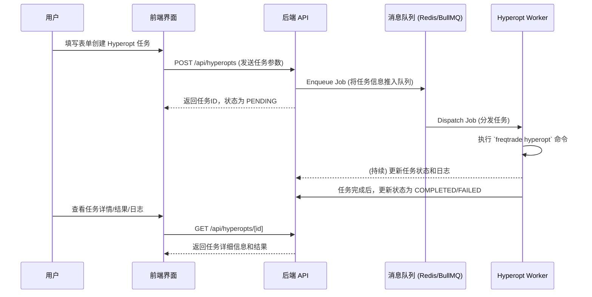
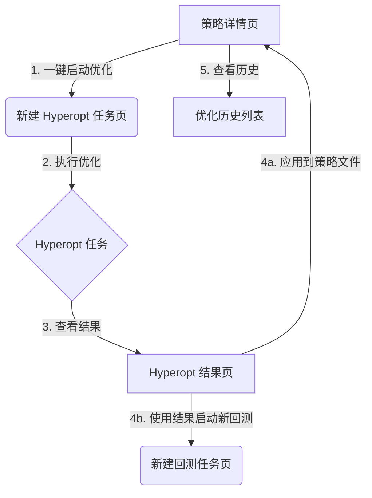

# Freqtrade Hyperopt 管理模块开发文档

## 1. 概述与目标

本文档旨在详细阐述 Freqtrade Hyperopt（超参数优化）管理模块的设计与实现方案。该模块的目标是为现有的回测管理平台无缝集成强大的参数优化能力，用户将能够通过图形化界面（UI）轻松地创建、管理、监控 Hyperopt 任务，并方便地查看、验证和应用优化结果，形成从策略开发、优化到验证的完整闭环。

## 2. 核心概念

- **优化任务 (Hyperopt Task)**: 一次完整的参数优化过程。
- **优化空间 (Spaces)**: 需要优化的参数组，如 `buy`, `sell`, `roi`, `stoploss` 等。
- **优化周期 (Epochs)**: Hyperopt 的迭代次数。
- **损失函数 (Loss Function)**: 评估每个周期结果好坏的数学函数，Hyperopt 的目标是找到使损失函数值最小的参数组合。
- **优化结果 (Results)**: 优化任务完成后生成的“最佳”参数组合。

## 3. 系统架构与工作流

本模块遵循平台现有的 **UI -> API -> 消息队列 -> Worker** 架构，以异步方式处理耗时的 Hyperopt 任务。

### 3.1. 整体架构



### 3.2. 模块联动工作流

我们致力于打造一个从策略到优化，再到验证的闭环体验。



## 4. 数据模型设计 (Prisma Schema)

为支持上述功能和联动，数据库模型设计如下：

```prisma
// src/prisma/schema.prisma

// --- 在 Strategy 模型中 ---
model Strategy {
  // ... a lot of fields
  id            String         @id @default(cuid())
  name          String
  // ...
  backtests     BacktestTask[]
  hyperoptTasks HyperoptTask[] // 新增: 关联到此策略的所有Hyperopt任务
}

// --- 在 BacktestTask 模型中 ---
model BacktestTask {
  // ... a lot of fields
  id         String   @id @default(cuid())
  strategyId String
  strategy   Strategy @relation(fields: [strategyId], references: [id], onDelete: Cascade)

  // 新增: 记录此回测是否由某个Hyperopt任务发起
  sourceHyperoptTaskId String?
  sourceHyperoptTask   HyperoptTask? @relation(name: "GeneratedBacktests", fields: [sourceHyperoptTaskId], references: [id], onDelete: SetNull)
}

// --- 新增 HyperoptTask 模型 ---
model HyperoptTask {
  id              String   @id @default(cuid())
  createdAt       DateTime @default(now())
  updatedAt       DateTime @updatedAt
  status          String   @default("PENDING") // PENDING, RUNNING, COMPLETED, FAILED
  epochs          Int
  spaces          String   // 存储逗号分隔的字符串，如 "buy,roi,stoploss"
  lossFunction    String
  timerange       String?
  jobId           String?  // BullMQ/Redis中的任务ID

  strategyId      String
  strategy        Strategy @relation(fields: [strategyId], references: [id], onDelete: Cascade)

  configId        String
  config          Config   @relation(fields: [configId], references: [id], onDelete: Cascade)

  bestResult      Json?    // 存储最佳结果的简报，用于快速展示
  resultsPath     String?  // 存储生成的pickle结果文件的路径
  logPath         String?  // 存储日志文件的路径

  // 新增: 关联到此Hyperopt任务生成的所有回测任务
  generatedBacktests BacktestTask[] @relation(name: "GeneratedBacktests")
}
```

## 5. 后端 API 设计

### `POST /api/hyperopts`
- **功能**: 创建一个新的 Hyperopt 任务。
- **请求体**: `{ "strategyId": "...", "configId": "...", "epochs": 100, "spaces": "buy,roi", "lossFunction": "SharpeHyperOptLossDaily", "timerange": "..." }`
- **逻辑**: 在数据库创建记录，并向消息队列推送作业。

### `GET /api/hyperopts`
- **功能**: 获取所有 Hyperopt 任务列表。

### `GET /api/hyperopts/[id]`
- **功能**: 获取指定任务的详细信息。

### `GET /api/hyperopts/[id]/logs`
- **功能**: 实时流式传输任务日志。

### `GET /api/hyperopts/[id]/results`
- **功能**: 解析并返回优化结果的 JSON 数据。需要一个安全的 Python 脚本来读取 pickle 文件。

### `POST /api/hyperopts/[id]/apply`
- **功能**: 将优化得到的最佳参数应用到对应的策略文件中。
- **警告**: 这是一个高风险操作，API 实现时必须有明确的提示和备份机制。建议通过 AST 解析进行修改，以保证代码结构的正确性。

### 对现有 API 的改造
- **`GET /api/strategies/[id]`**: 需要支持 `include: { hyperoptTasks: true }` 来返回关联的优化历史。
- **`POST /api/backtests`**: 请求体需要增加一个可选字段 `overrideParams: Json?`。当此字段存在时，`backtestWorker` 将使用这些参数覆盖默认配置。

## 6. 后台 Worker 设计

### `src/workers/hyperoptWorker.ts`
- **功能**: 消费队列中的 Hyperopt 作业，执行 `freqtrade hyperopt` 命令。
- **逻辑**:
  1.  接收作业，查询任务详情。
  2.  更新任务状态为 `RUNNING`。
  3.  动态构建命令行字符串，并使用 `child_process.spawn` 执行。
  4.  将 `stdout` 和 `stderr` 重定向到日志文件。
  5.  监控进程退出事件，成功则更新任务状态为 `COMPLETED` 并保存结果路径；失败则更新为 `FAILED`。

### `src/workers/backtestWorker.ts` (改造)
- **功能**: 支持使用临时参数启动回测。
- **逻辑**:
  1.  在启动回测前，检查作业载荷中是否存在 `overrideParams`。
  2.  如果存在，将这些参数写入一个临时的 JSON 文件。
  3.  在 `freqtrade backtest` 命令中，使用 `--strategy-list` 和一个指向临时配置的 `--config` 参数来加载这些覆盖项。
  4.  回测结束后，清理临时文件。

## 7. 前端 UI 设计

### 7.1. 策略详情页 (`/strategies/[id]`)
- 新增 **“启动 Hyperopt 优化”** 按钮。
- 新增 **"优化历史"** Tab，列表展示关联的 `hyperoptTasks`。

### 7.2. Hyperopt 列表页 (`/hyperopts`)
- 使用 `Table` 组件展示所有 Hyperopt 任务。
- 列: 策略, Epochs, Spaces, 损失函数, 状态, 创建时间, 操作。
- 提供 "新建优化任务" 按钮。

### 7.3. Hyperopt 新建页 (`/hyperopts/new`)
- 表单，用于配置新任务。
- 自动填充从策略页跳转过来的策略ID。

### 7.4. Hyperopt 详情页 (`/hyperopts/[id]`)
- **顶部**: 任务摘要卡片。
- **Tab 1: 最佳结果**:
  - 清晰展示优化后的各项参数。
  - **“一键复制”** 功能。
  - **“应用到策略”** 按钮 (触发 `POST /api/hyperopts/[id]/apply`)。
  - **“使用此结果进行回测”** 按钮 (跳转到新建回测页并携带覆盖参数)。
- **Tab 2: 周期列表**: 表格展示每个周期的详细结果。
- **Tab 3: 实时日志**: 嵌入 `RealtimeLogViewer` 组件。

### 7.5. 回测新建页 (`/backtests/new`) (改造)
- 能够从 URL 参数中读取 `overrideParams`。
- 如果存在，则在页面上显示一个不可编辑的区域，展示这些即将被应用的覆盖参数。
- 将这些参数随表单一起提交到 `POST /api/backtests`。